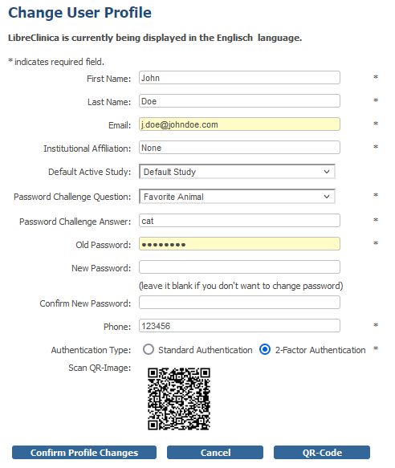
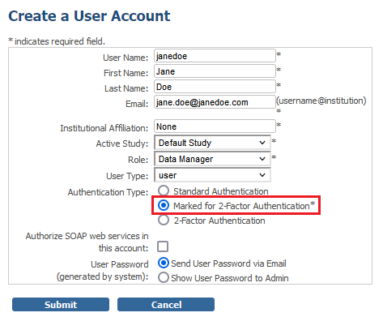
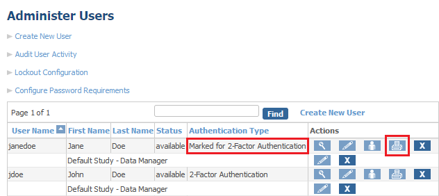
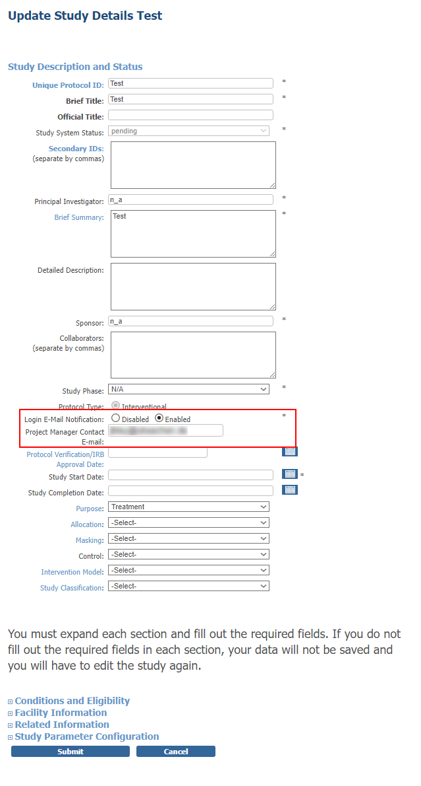
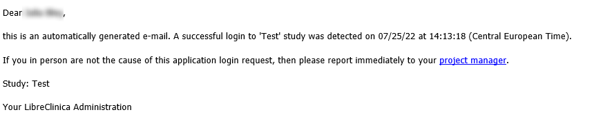

LibreClinica 1.2 for Administrators
===================================

[https://libreclinica.org](https://libreclinica.org) © 2022

Preface

This manual describes the main activities of the Administrator-role in LibreClinica 1.2.0: System Configuration, 2-Factor Authentication, automatic E-Mail notification, etc.

To use this manual an account with the role of Administrator is the only requirement.

Please contact us for other manuals for the roles of Clinical Research Coordinator or Monitor or if you would like a tailor-made manual, based on this one.

[The LibreClinica Community](https://libreclinica.org)

The manual is a distributed under the <a name="firstheading">Creative Commons Attribution-ShareAlike 3.0 Unported License . This means you are free to copy, distribute and transmit the work, and to adapt the work under the following conditions:</a>

1 you must attribute the work in the manner specified by the author (but not in any way that suggests that they endorse you or your use of the work.); please contact us for details

2 if you alter, transform, or build upon this work, you may distribute the resulting work only under the same, similar or a compatible license.

# Contents

[General 2-factor authentication configuration](#general-2-factor-authentication-configuration)

[Configuring 2-factor authentication - APPLICATION](#configuring-2-factor-authentication-application)

[Configuring 2-factor authentication - LETTER](#configuring-2-factor-authentication-letter)

[Configuring login e-mail notification](#configuring-login-e-mail-notification)

# General 2-factor authentication configuration

In general 2-factor authentication can be configured within  _datainfo.properties_  file (which is deactivated by default to ensure not to break already running systems which upgrade from versions prior LibreClinica 1.2). The following options can be made:

1 2fa.activated

To generally enable 2-factor authentication just adjust the setting like this:  _2fa.activated=true_ . Please note that a restart of the LibreClinica application is necessary for the changes to take effect.

2 2fa.type

There are two types of how the mandatory authentication code for the authenticator app is provided: APPLICATION (default), LETTER. 

When set to  _APPLICATION_  the user itself is responsible for activating their accounts to use 2-factor authentication. The QR code gets directly displayed within LibreClinica application itself and can directly be scanned with the authenticator app. This settings is more convenient. But please note that this setting does not protect you from [man-in-the-middle attacks](https://en.wikipedia.org/wiki/Man-in-the-middle_attack).

When set to  _LETTER_  the QR code will be provided within a generated PDF file for printout. The PDF printout can then be made available by project managers via postal order to the according users. Nevertheless, this possibility means more manual work but the  _LETTER_  option is a more secure way to avoid potential [man-in-the-middle attacks](https://en.wikipedia.org/wiki/Man-in-the-middle_attack).

Administrators are highly recommended to always download the generated PDF file instead of just viewing it within the browser to avoid that the file remains in the local temporary directory and could potentially be viewed by unauthorized third parties.

3 2fa.dueDate

In combination with  _2fa.type=LETTER_  this setting can be used to force users to activate 2-factor authentication in the future. If the date has passed, and a user who has not activated 2-factor authentication yet he/she will no longer be able to successfully log in to the system.

Please ensure to provide a date in valid [ISO 8601](https://en.wikipedia.org/wiki/ISO_8601#Calendar_dates) format: YYYY-MM-DD

4 Authenticator Apps

There are several solutions of mobile  _authenticator apps_  on the market. The most commonly known solutions are  _Google Authenticator_  and  _Microsoft Authenticator_ . But also other solutions will work.

- https://play.google.com/store/search?q=authenticator&c=apps
- https://www.apple.com/de/search/authenticator

Also note that there is no internet or network needed as authenticator apps are working on a time basis.

# Configuring 2-factor authentication (APPLICATION)

The following workflow describes the procedure how  _LibreClinica_  users can activate their account for 2-factor authentication.

Just log in to the system and click on _Tasks_  ->  _Update Profile_ . When switching  _Authentication Type_  to  _2-Factor Authentication_  the  _QR-Code_ button is getting visible. Click  _QR-Code_ to generate the QR code and scan it with your authenticator app on your mobile device. When successfully scanned the changes have to be confirmed by pressing _Confirm Profile Changes_ and finally update your made profile changes.

From now on login to the system will only be granted when providing the valid additional number code created by the authenticator app. The code will only be valid for about 30 seconds.

Users are recommended to rename the scanned 2-factor profile within their authenticator app to ensure uniqueness when maybe working with multiple  _LibreClinica_  instances.

# Configuring 2-factor authentication (LETTER)

The following workflow describes the procedure how administrators can activate a user's account for 2-factor authentication.

Create a new or edit an existing user account. Then assign the _Marked for 2-Factor Authentication_  as  _Authentication Type_ .

After persisting the changes got to  _Tasks -> Users_  and click the printer icon for the specific user to generate a PDF printout. 

Provide the PDF printout or the original file itself to the user via postal order or transmission via a secure way. At the end the generated file should permanently be deleted.

# Configuring login e-mail notification

The following workflow describes the procedure how e-mail notifications can be activated for a study. 
Create a new or edit an existing study. Here notifications can be enabled for the whole study including all sites. 
It is possible to specify the e-mail address for the project management, which is referenced in every notification e-mail.

After persisting the changes, everytime a user logs in to the study or connected site a notification e-mail is send.
The notification e-mail contains information regarding study/site, date, time and contact address of the project management.

